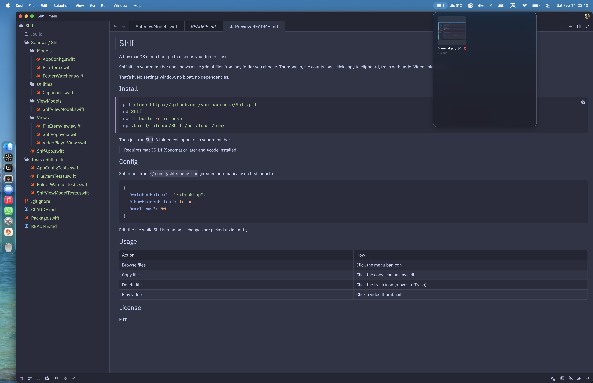

# Shlf

A tiny macOS menu bar app that keeps your favourite folder close.

Shlf sits in your menu bar and shows a live grid of files from any folder you choose. Thumbnails, file counts, one-click copy to clipboard, delete to Trash, inline rename, double-click to open. Videos play inline.



## Install

### Homebrew

```bash
brew install --cask spissable/tap/shlf
```

This installs Shlf.app to `/Applications`. Launch it from Spotlight or the Applications folder.

### From source

```bash
git clone https://github.com/spissable/shlf.git
cd shlf
swift build -c release
cp .build/release/shlf /usr/local/bin/
```

Then just run `shlf`. A folder icon appears in your menu bar.

> Building from source requires macOS 14 (Sonoma) or later and Xcode.

## Config

Shlf reads from `~/.config/shlf/config.json` (created automatically on first launch):

```json
{
  "watchedFolder": "~/Desktop",
  "showHiddenFiles": false,
  "maxItems": 50
}
```

Restart Shlf after editing for changes to take effect.

## Usage

| Action       | How                                           |
| ------------ | --------------------------------------------- |
| Browse files | Click the menu bar icon                       |
| Copy file    | Click the copy icon on any cell               |
| Delete file  | Click the trash icon (moves to Trash)         |
| Rename file  | Double-click the filename, press Enter/Escape |
| Open file    | Double-click a thumbnail                      |
| Play video   | Click a video thumbnail                       |

## License

MIT
